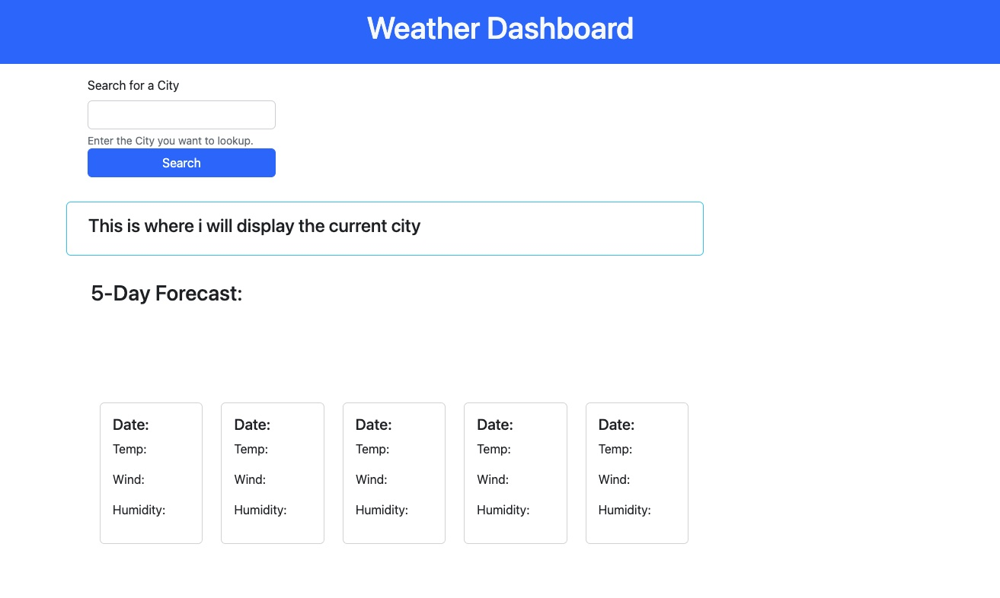

# Server Side APIs Challenge: Weather Dashboard


## Description

This project was created for the Week 6 challenge of my coding bootcamp. The goal of this challenge is to create a webpage that uses third-party API's to create a weather dashboard that will run in the browser and feature and dynamically updated HTML and CSS. Third party API's allow developers to access their data and functionality by making requests with specific parameters to a URL. 

```
User Story
AS A traveler
I WANT to see the weather outlook for multiple cities
SO THAT I can plan a trip accordingly
```
```
Acceptance Criteria
GIVEN a weather dashboard with form inputs
WHEN I search for a city
THEN I am presented with current and future conditions for that city and that city is added to the search history
WHEN I view current weather conditions for that city
THEN I am presented with the city name, the date, an icon representation of weather conditions, the temperature, the humidity, and the the wind speed
WHEN I view future weather conditions for that city
THEN I am presented with a 5-day forecast that displays the date, an icon representation of weather conditions, the temperature, the wind speed, and the humidity
WHEN I click on a city in the search history
THEN I am again presented with current and future conditions for that city
```
## Installation
N/A

## Usage

This webpage will show weather data for different cities.  


https://tropical9.github.io/6-Server-Side-APIs-Weather-Dashboard/


## Credits


## License

[](https://opensource.org/licenses/MIT)
---

 